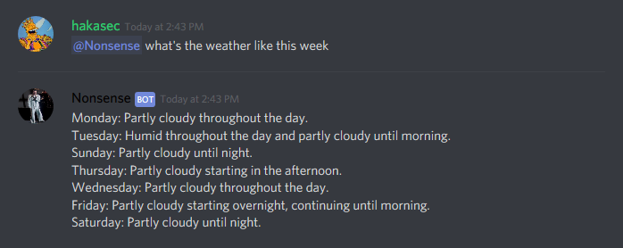
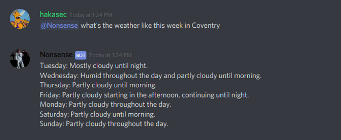
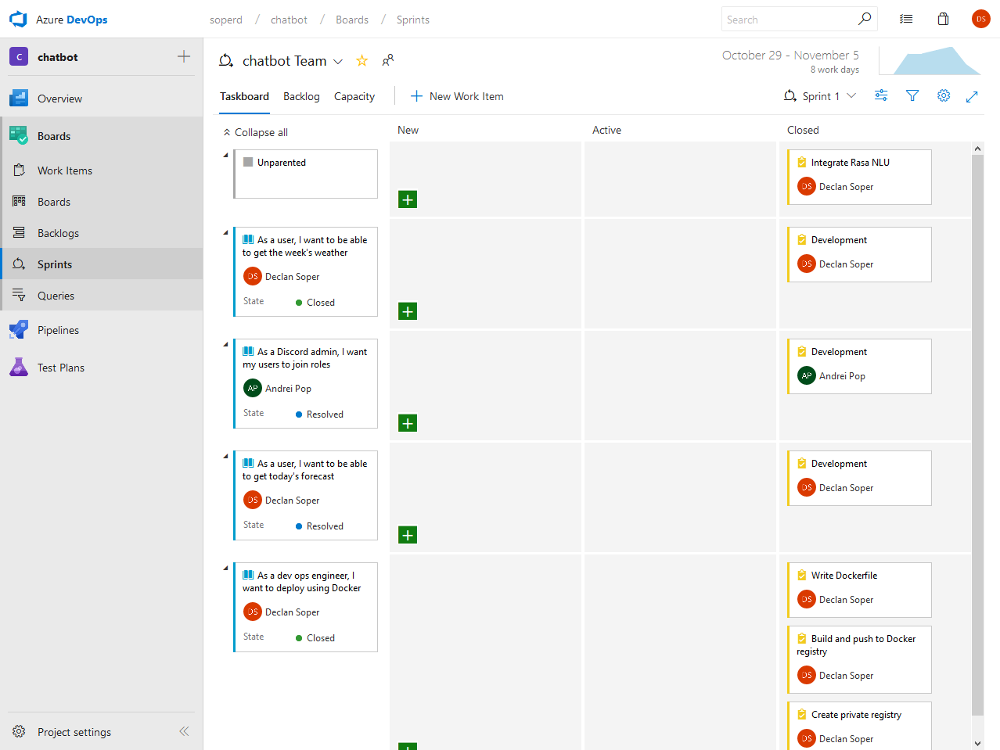
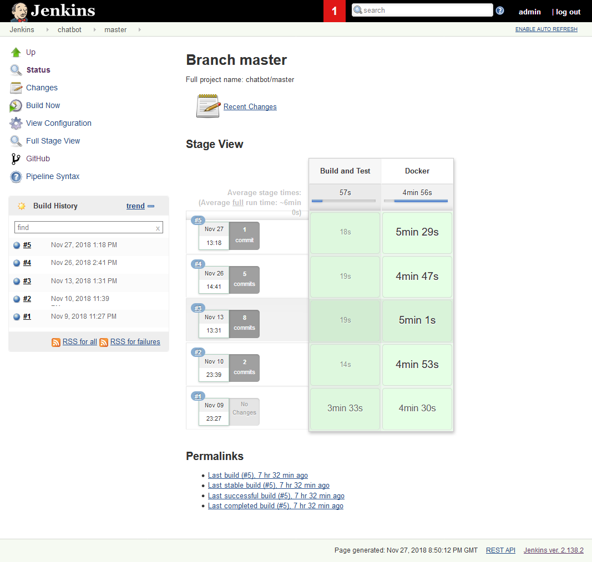
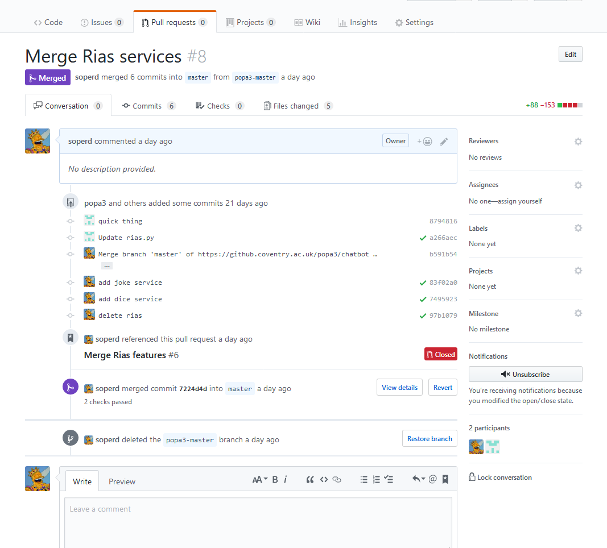
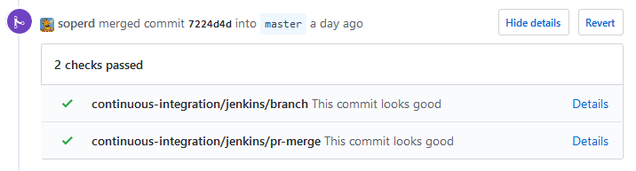

## Introduction
This is a reflective piece on my Year 1 university group project. Please view the code [here](https://github.coventry.ac.uk/soperd/chatbot).

The project is a chatbot written in Python 3 primarily for use with Discord. Current features include:
- Discord integration with [Discord.py](https://github.com/Rapptz/discord.py)!
- Some natural language understanding with [RasaNLU](https://rasa.com/)!
- Weather forecast integration with [DarkSky](https://darksky.net/)!
- Location services with [Nominantim by OpenStreetMaps](https://nominatim.openstreetmap.org/)!
- Datastore integration with [Redis](https://redis.io/)!
- Deployable with [Docker](https://www.docker.com/)!

## Features

### Weather
This week's weather. This uses the user's saved location if they set one:



This week's weather at a given location (Coventry):



### Location

The bot can remember your location, resolve, and recite it:


This automatically resolves the location's coordinates using [Nominantim](https://nominatim.openstreetmap.org/).

## Design
As one of the more experienced members of the team, I set down the foundation for the bot's design and structure. At the time, we were unsure which platforms we wanted to target, so I set out by separating the platform-specific implementations from the platform-neutral services.

I did this by putting all code that provided some kind of generic services into the `handlers` folder of the project. Here you can find a file called `services.py` which contains a class called `Service` that acts as a configurable base class. All other services in `handlers` inherits this `Service` class and implements its own functionality. For example, the `WeatherService` class in `weather.py` contains methods like `get_weather_at` that takes a given longitude and latitude and queries DarkSky's forecast API. 

The services can then be registered using the `register_service` decorator that can be found in `services.py`. The decorator takes the name of the service as a parameter, then resolves the config provided to that service with the same name detailed in `config.json`, and stores it in the dictionary `global_services`.

For all the platform specific implementations, I put the code in the `wrappers` folder. This contains a file called `bot.py` which has a class `ChatBot`. This acts as an interface that defines common behaviours for every bot with methods such as `start` and `stop`, since the reasoning behind it was that every bot must at least start and be able to be stopped. At the moment, the only implemented platform is Discord, the code for which can be seen in `discord.py`. Here we can see the bot inherits `ChatBot`, implements the `start` method and defines its own. `ChatBot` also declares three class members:
- `services`: A dictionary containing instances of services for the bot to use.
- `datastore`: A Redis client object for the bot to access the datastore.
- `config`: A `ConfigDict` object that acts as a representation of the bot's config in `config.json` (see below).

Both services and wrappers are configurable via the `config.json` file, which looks something like this:

```json
{
    "discord": {
        "token": "<DISCORD TOKEN HERE>",
        "services": [
            "weather",
            "location"
        ]
    },
    "services": {
        "weather": {
            "token": "<DARKSKY TOKEN HERE>"
        }
    },
    "redis": {
        "host": "localhost",
        "port": 6379
    }
}
```

This details that the Discord bot has a token and a set of services it can use. For this example, it can use the weather and location services. When we run the bot using the `run_discord.py` script, this passes the `discord` configuration to the `DiscordBot` class constructor, which in turn calls `ChatBot`'s constructor. If the optional parameter `services` is `None` then `ChatBot`'s constructor then will find the services listed in `config.json` from the `global_services` and store them in the `services` class member. This was my attempt to "inject" services into the bot automatically.

`DiscordBot` is currently the only functioning bot. It uses the [Discord.py](https://github.com/Rapptz/discord.py) library which makes for easy integration with Discord's API.

## Development Process
During the making of the this project, my team worked using Scrum methodologies and tracked user stories, features and tasks with an online Kanban/Scrum board provided by [Azure DevOps](https://azure.microsoft.com/en-us/services/devops/?nav=min). Sprints were one week in duration to match up with how our work was being marked and we estimated work before each sprint using and [PlanningPoker.com](https://www.planningpoker.com/).



All code was to be hosted on Coventry University's GitHub server. The stable version of the project is hosted on my account, with the other members of my team having their own fork. This was done to enforce a policy of code merging via pull requests, rather than allowing every member to merge freely, as I thought this could create merge conflicts and become messy quickly.

Setting up Azure DevOps, I noticed their Continuous Integration platform and thought it would be a good idea to have some kind of CI for this project. However, with Azure, it wanted us to move our repo from the university's GitHub which wasn't ideal. I have had experience with [Jenkins](https://jenkins.io/) before and recalled setting it up on my home server, so I decided to try it out with this project and after much trial and error with Jenkin's pipeline syntax, I managed to get something working.

Below is the current pipeline configuration. The idea here was to have one step for the building and testing of the project and the other for Docker building and deployment to a private registry also hosted on my home server.



I used the webhook feature in GitHub so that Jenkins would be notified of new PRs, commits, and branches. This meant that Jenkins would automatically build and test the codebase as the repo was being updated. Jenkins is also able to inform GitHub of the outcome of the pipeline and display a green tick or red cross if the pipeline succeeded or failed respectively.

Below is an example. Each commit with a green tick has been ran on Jenkins and passed all steps.





## Reflection
I think my design worked well for the most part. If we decided we wanted to integrate the bot into WhatsApp or Messenger, I feel that my design would aid in porting our features over to the new platform. This design also allows for multiple bots with similar features on the same platform, which I am happy with. I do however, believe that in some areas my code is poorly implemented, such as the `global_services` dictionary. This seems like a bit of a hack, and I feel I could have found a better way to inject services into the bots. That being said, this is the first time I've used a custom decorator in Python and I can see its potential elsewhere.

The `global_config` object in `config.py` is also a bit of a bad design in my opinion, but was required to configure `global_services`. My idea with configuration was to have it being passed around to objects that needed it, but instead I have a mix of two ideas: one where the config is passed around and one where it can be accessed globally.

I am happy with the [Redis](https://redis.io/) integration as this was my first time trying out a NoSQL solution. I feel that its simplicity made it easier to work with than your traditional SQL solution, which would require the creation and management of tables and schemata. If we did go with an SQL solution, I think the use of an ORM (Object-Relational Mapping) framework such as [SQLAlchemy](https://www.sqlalchemy.org/) would've kept the team efficient.

I also wished I spent more time working on refining and creating features to give the bot much more personality. But as I whole, I am happy with the outcome.